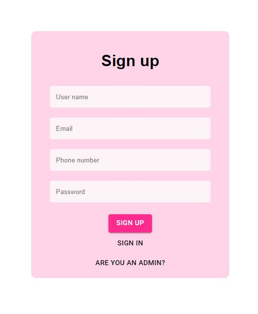
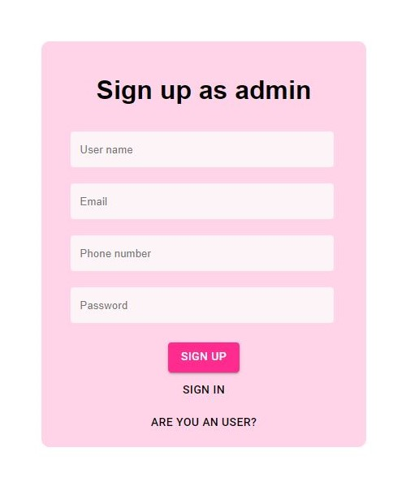
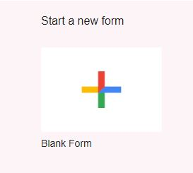
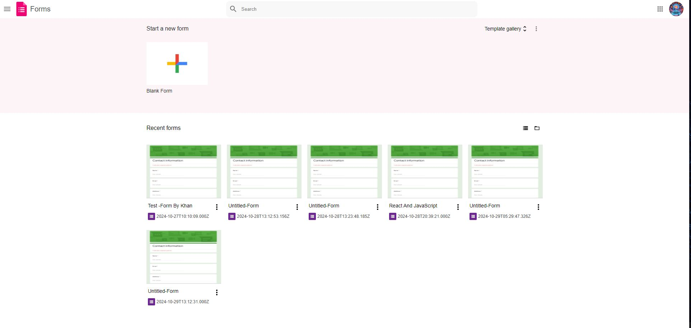
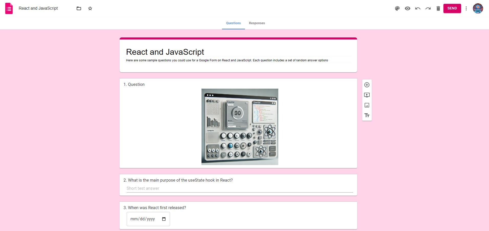
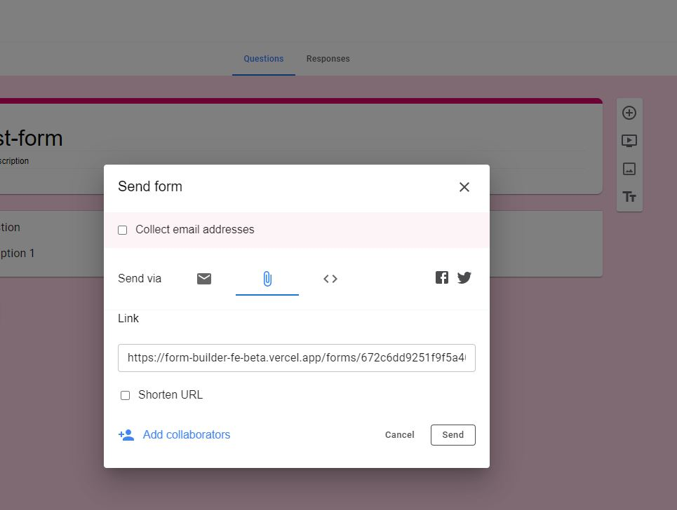

# Form Builder

## Tech stack;

**Frontend** : ReactJS, Typescript

**UI Framework** : Material UI

**Notification library** : react-hot-toast

**Backend**: NodeJS, Express and Typescript

**Database** : MongoDB (NoSql)

## Features implemented:

1. Register and Login the user: 
   a. For registration, users need to provide their name, email, phone number, and password. After logging in, the user can delete their account themselves.
   b. Once registered with an email, the user cannot create another profile with a different name using that same email.
   c. Users can add a profile image and update their details.

2. Register and Login as an Admin:
   a. An admin will register as an admin.
   b. The admin can view data of all users and access any forms they have created. The admin also has the ability to delete any user, as well as delete their own account if they wish.
   
   
3. Creating the new form.  
4. Opening the created forms.
5. Editing the form :

   
   a.Adding Questions:
      Click on the question type you want to add Question Types: multiple choice, checkboxes, image add, short answer, paragraph, date and time. from the toolbar.
      Enter your question text and set any additional options (e.g., choices for multiple-choice questions).
   b.Editing Questions:
      Click on a question to edit its text or options.
      Use the "Required" toggle at the bottom right of each question to make it mandatory or optional.
   c.Add Image in the question form   
   d.Adding, removing and editing the option
   e.Copying the existing question
   f.Deleting the question
   
7. When ever user do above operations the tool box typically adjusts its position beside the question box you are actively editing.
8. After scrolling, the toolbox typically adjusts its position beside the question box you are actively editing.
9. User can view the form by clicking the Eye icon from form header
10. User can click on Save button to save the form
11. User can delete the form by clicking the delete icon from form header
12. User can share the link of a document to ge the response
    
    
13. User can see who all have responded in the response tab, live update happens here table will be updated as soon as user response to the form
14. User can drag and drop the questions to reorder the questions

**Project Live** : [https://form-builder-fe-beta.vercel.app/]

## Available Scripts

In the project directory, you can run:
1. `npm install`
2. Change the backend path: [https://form-builder-be.onrender.com] to [http://localhost:9000]
3. Run Backend code: [https://github.com/ruhulashazid/form-builder-be]
4. `npm start`
### chenge 

Runs the app in the development mode.\
Open [http://localhost:3000](http://localhost:3000) to view it in the browser.
